# 参会者智能问答系统

一个参会者数据智能问答系统，支持 CSV 数据导入、结构化 SQL 查询、RAG 语义问答，以及销售线索分析。系统将参会者名单转化为一个可交互的智能对话助手，适合用于会议运营、会后销售跟进、参会者画像分析和企业客户线索挖掘。

## 项目亮点

- **一体化聊天窗口**：Header、数据管理、聊天消息和输入框位于同一个固定高度窗口内。
- **CSV 数据导入**：支持上传参会者 CSV，解析后写入本地 SQLite 数据库。
- **基础 SQL 问答**：对高意向参会者、公司参会人数、行业分布、地区统计等问题进行确定性查询。
- **RAG 语义问答**：基于 Chroma 向量库和本地 embedding 模型，对兴趣方向、备注和参会者资料进行语义检索。
- **销售线索分析**：支持智能客服 / Agent、Top 10 跟进名单、LLMOps / AI Infra / 向量数据库公司聚合等加分题分析。
- **单轮处理，多轮展示**：每次提问独立路由和处理，不把历史对话传给模型；页面保留本次会话历史及每轮对应表格。
- **结果可下载**：查询结果和销售线索分析表格支持 CSV 下载。

## 功能预览

系统界面包含四个区域：

1. **顶部状态栏**：展示数据加载状态、向量索引状态和 API 连接状态。
2. **数据管理面板**：上传 CSV、选择追加或覆盖导入、写入数据库、构建向量索引。
3. **聊天消息区**：展示欢迎语、用户问题、助手回答、结果表格和 RAG 检索依据。
4. **底部输入区**：输入自然语言问题并发送。

典型演示流程：

1. 上传参会者 CSV。
2. 点击“写入数据库”。
3. 点击“构建向量索引”。
4. 输入基础查询问题或销售线索分析问题。
5. 查看回答、表格、下载结果 CSV。

> 注意：演示数据、数据库文件、向量索引、`.env` 和 API Key 不会提交到仓库。请在本地自行准备数据和环境变量。

### 项目截图

#### 1. 初始欢迎页

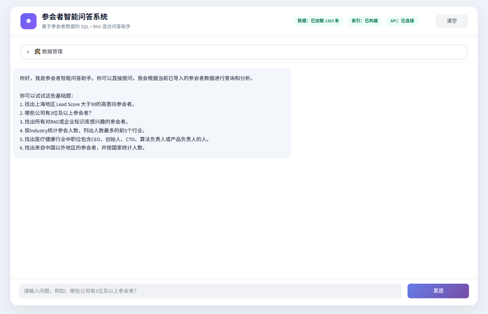

#### 2. 数据管理：上传 CSV

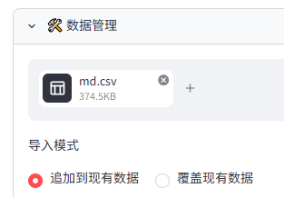

#### 3. 数据写入与向量索引状态

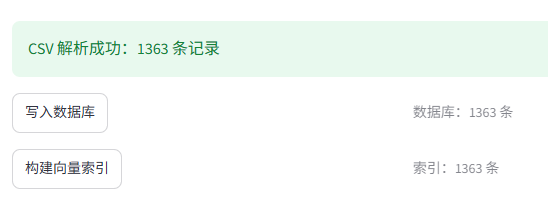

#### 4. 基础查询：上海高意向参会者

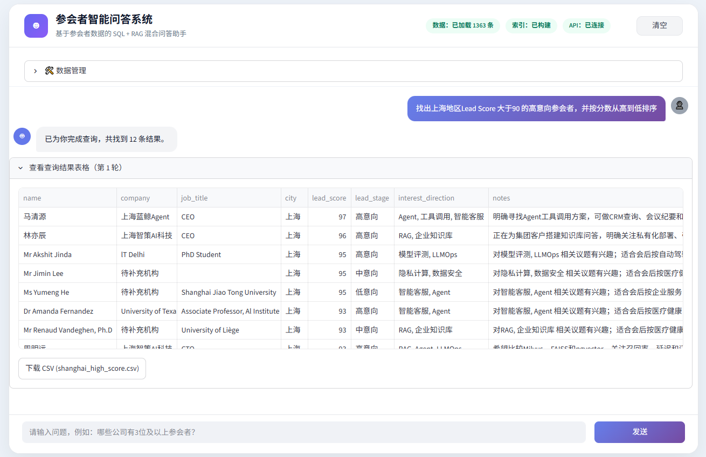

#### 5. 基础查询：公司参会人数统计

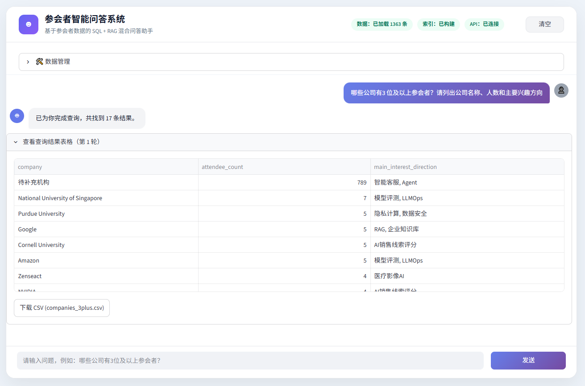

#### 6. 基础查询：RAG / 企业知识库兴趣

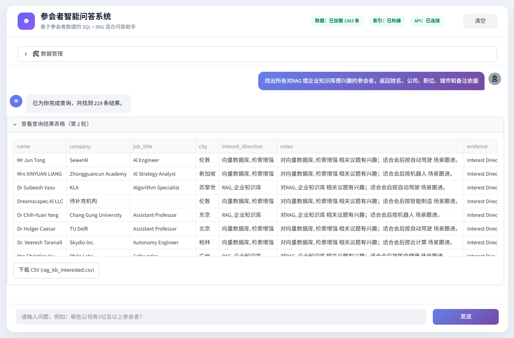

#### 7. 基础查询：Top 5 行业统计

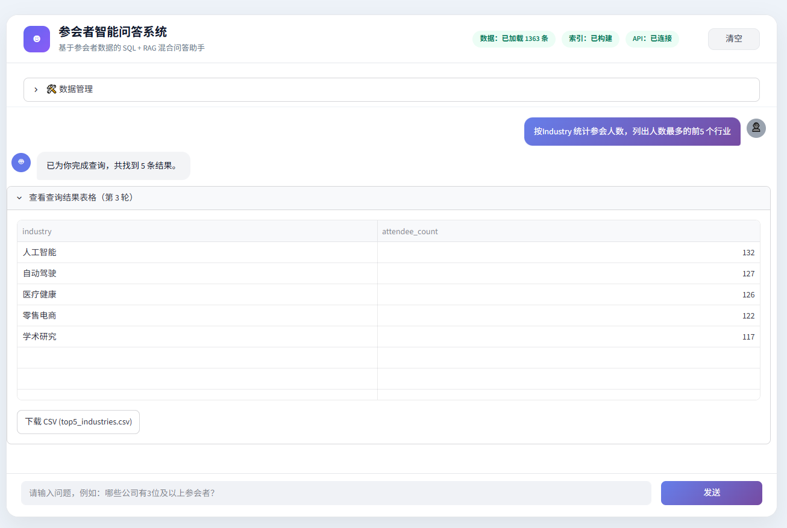

#### 8. 基础查询：医疗健康关键职位

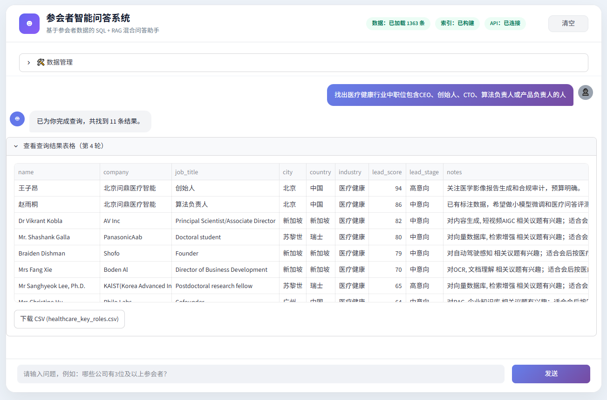

#### 9. 基础查询：中国以外地区统计

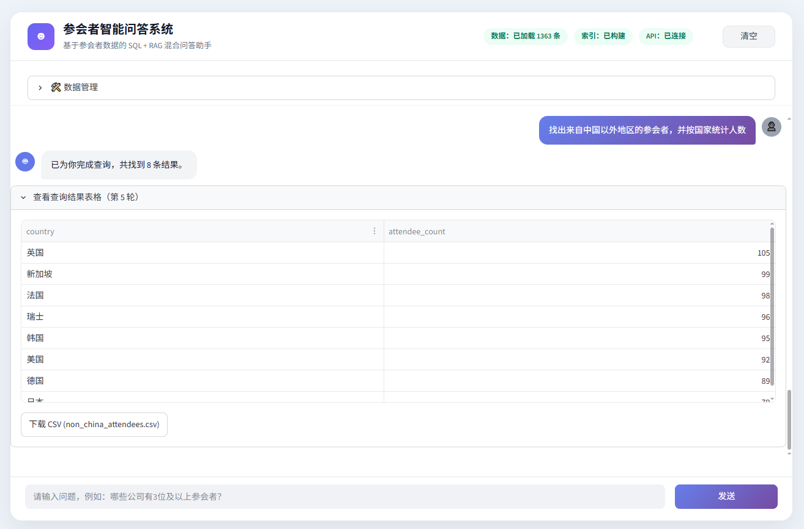

#### 10. 加分题：智能客服 / Agent 销售线索

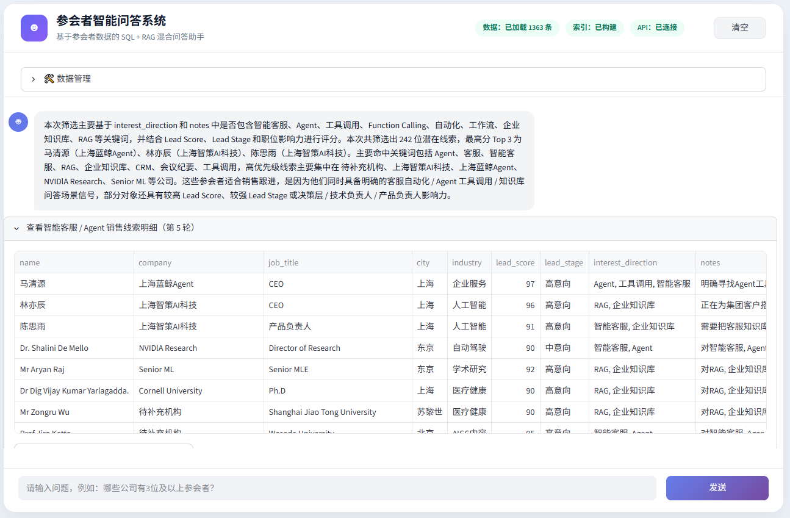

#### 11. 加分题：Top 10 销售跟进名单

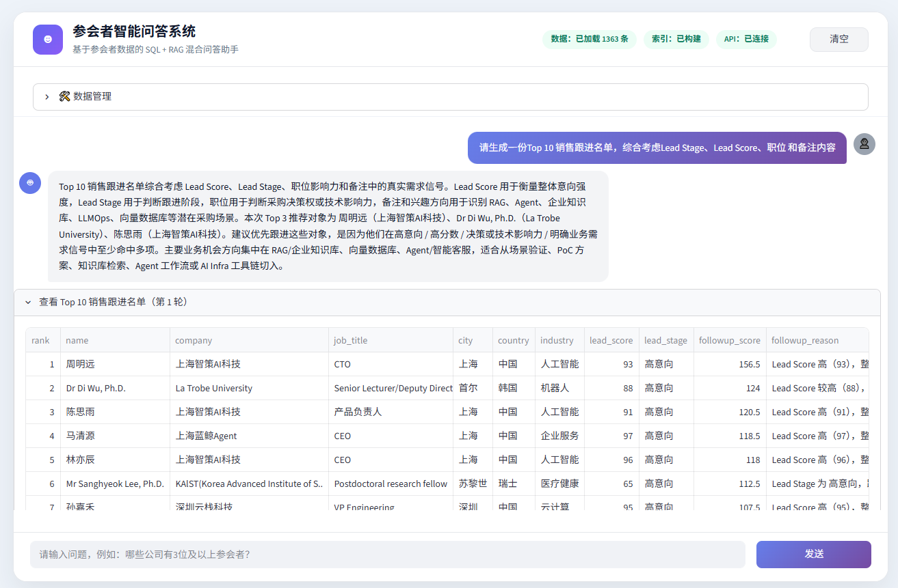

#### 12. 加分题：LLMOps / AI Infra / 向量数据库公司聚合

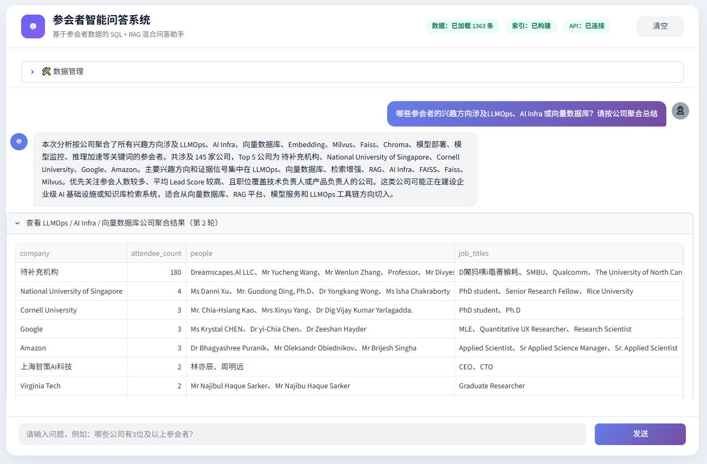

## 技术栈

| 模块 | 技术 |
| --- | --- |
| Web UI | Streamlit |
| 数据处理 | pandas |
| 结构化存储 | SQLite |
| 语义检索 | ChromaDB |
| Embedding | sentence-transformers |
| LLM 调用 | OpenAI-compatible API |
| 配置管理 | python-dotenv |

## 目录结构

```text
Participant-Intelligent-QA-System/
├── app.py
├── requirements.txt
├── README.md
├── .gitignore
├── docs/
│   └── images/
│       ├── 1.png
│       ├── ...
│       └── 12.png
└── src/
    ├── __init__.py
    ├── config.py
    ├── csv_loader.py
    ├── db.py
    ├── lead_analysis.py
    ├── llm_client.py
    ├── prompts.py
    ├── query_router.py
    ├── rag_pipeline.py
    ├── sql_queries.py
    ├── ui_helpers.py
    └── vector_store.py
```

本地运行时会自动或手动生成以下目录和文件，但它们不会提交到 GitHub：

```text
data/
├── md_rag.db
├── uploads/
└── vector_store/
.env
.venv/
```

## 安装与运行

### 1. 克隆项目

```bash
git clone https://github.com/deeplearning151/Participant-Intelligent-QA-System.git
cd Participant-Intelligent-QA-System
```

### 2. 创建虚拟环境

Windows:

```bash
python -m venv .venv
.venv\Scripts\activate
```

macOS / Linux:

```bash
python -m venv .venv
source .venv/bin/activate
```

### 3. 安装依赖

```bash
pip install -r requirements.txt
```

如果构建向量索引时报错 `No module named 'sentence_transformers'`，请确认依赖安装完整：

```bash
pip install sentence-transformers
```

### 4. 配置大模型 API

在项目根目录新建 `.env` 文件：

```env
LLM_API_KEY=your_api_key_here
LLM_BASE_URL=https://api.deepseek.com
LLM_MODEL=deepseek-chat
TOP_K_RETRIEVAL=20
```

说明：

| 变量 | 必填 | 说明 |
| --- | --- | --- |
| `LLM_API_KEY` | 是 | 大模型 API Key |
| `LLM_BASE_URL` | 否 | OpenAI-compatible API 地址 |
| `LLM_MODEL` | 否 | 模型名称 |
| `TOP_K_RETRIEVAL` | 否 | RAG 检索返回数量 |

`.env` 文件包含敏感信息，已被 `.gitignore` 排除，请不要提交。

### 5. 启动应用

```bash
streamlit run app.py
```

启动后访问：

```text
http://localhost:8501
```

## 数据格式

上传的 CSV 需要包含以下字段：

| 字段 | 说明 |
| --- | --- |
| `Name` | 参会者姓名 |
| `Job Title` | 职位 |
| `Company` | 公司 |
| `City` | 城市 |
| `Country` | 国家 |
| `Industry` | 行业 |
| `Interest Direction` | 兴趣方向 |
| `Session` | 参会场次 |
| `Lead Stage` | 线索阶段 |
| `Lead Score` | 线索分数 |
| `Email` | 邮箱 |
| `Notes` | 备注 |

系统会自动清洗字段、转换 `Lead Score`，并将数据写入 SQLite。

## 支持的问题示例

### 基础 SQL 查询

```text
找出上海地区 Lead Score 大于90的高意向参会者。
```

```text
哪些公司有3位及以上参会者？
```

```text
找出所有对RAG或企业知识库感兴趣的参会者。
```

```text
按Industry统计参会人数，列出人数最多的前5个行业。
```

```text
找出医疗健康行业中职位包含CEO、创始人、CTO、算法负责人或产品负责人的人。
```

```text
找出来自中国以外地区的参会者，并按国家统计人数。
```

### 销售线索分析

```text
哪些参会者适合作为“智能客服 / Agent 工具调用”方向的销售线索？请说明筛选依据。
```

```text
请生成一份 Top 10 销售跟进名单，综合考虑 Lead Stage、Lead Score、职位和备注内容。
```

```text
哪些参会者的兴趣方向涉及 LLMOps、AI Infra 或向量数据库？请按公司聚合总结。
```

### RAG 语义问答

```text
有哪些参会者的备注中体现了企业知识库、RAG 或智能问答落地需求？
```

```text
哪些公司可能正在建设 AI Infra 或向量检索系统？
```

## 核心模块说明

| 文件 | 作用 |
| --- | --- |
| `app.py` | Streamlit 页面、状态管理、用户交互和结果展示 |
| `src/config.py` | 路径、API、RAG 参数等配置 |
| `src/csv_loader.py` | CSV 解析、字段校验和清洗 |
| `src/db.py` | SQLite 建表、写入和读取 |
| `src/query_router.py` | 根据问题内容路由到 SQL、加分题或 RAG |
| `src/sql_queries.py` | 基础题 SQL 查询函数 |
| `src/lead_analysis.py` | 销售线索分析、推荐理由和公司聚合总结 |
| `src/vector_store.py` | Chroma 向量库构建与检索 |
| `src/rag_pipeline.py` | RAG 检索、Prompt 构建和 LLM 回答 |
| `src/llm_client.py` | OpenAI-compatible LLM API 调用 |
| `src/prompts.py` | RAG Prompt 模板 |
| `src/ui_helpers.py` | CSV 下载等 UI 辅助函数 |

## 常见问题

### 1. 构建向量索引失败：`No module named 'sentence_transformers'`

说明依赖未安装或当前运行环境不是安装依赖的虚拟环境。执行：

```bash
pip install sentence-transformers
```

然后重新启动 Streamlit。

### 2. 顶部显示 API 未连接

请检查根目录 `.env` 中是否配置了：

```env
LLM_API_KEY=your_api_key_here
```

### 3. RAG 问答提示没有向量库

请先完成：

1. 上传 CSV；
2. 写入数据库；
3. 构建向量索引。

### 4. SQL 查询没有结果

请确认 CSV 字段完整，并且数据已经成功写入数据库。

## 适用场景

- 会后参会者数据分析；
- 销售线索挖掘；
- 高意向客户筛选；
- 企业知识库 / RAG / Agent 方向商机识别；
- 公司级销售跟进名单生成；
- 会议运营数据问答助手演示。

